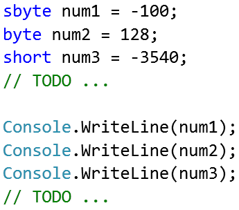

Exercises: Data Types and Variables
===================================

Problems for exercises and homework for the [“Programming Fundamentals” course
\@ SoftUni](https://softuni.bg/courses/programming-fundamentals).

You can check your solutions here: <https://judge.softuni.bg/Contests/392>.

Numeral Types and Type Conversion
=================================

\1. Practice Integer Numbers
===========================

Create a new C\# project and create a program that **assigns integer values** to
**variables**. Be sure that each **value** is stored in the **correct variable
type** (try to find the most suitable variable type in order to save memory).
Finally, you need to **print** all variables to the console.

### Examples

| **Input**    | **Output**                                                        |
|--------------|-------------------------------------------------------------------|
| *(no input)* | \-100 
| | 128 | 
| | -3540 |
| | 64876 |
| | 2147483648  |
| | -1141583228  |
| | -1223372036854775808 |

### Hints

Follow the idea in the code below:

2. Practice Floating Point Numbers
=================================

Create a new C\# project and create a program that **assigns floating point
values** to **variables**. Be sure that each **value** is stored in the
**correct variable type** (try to find the most suitable variable type in order
to save memory). Finally, you need to **print** all variables to the console.

### Examples

| **Input**    | **Output**                                                     |
|--------------|----------------------------------------------------------------|
| *(no input)* | 3.141592653589793238 1.60217657 7.8184261974584555216535342341 |

### Hints

Just like at the previous problem, declare several variables of appropriate
**floating-point data type**, assign the above listed values and **print** them.

Exchange Variable Values
------------------------

Declare two integer variables **a** and **b** and assign them with 5 and 10 and
after that **exchange their values** by using some programming logic. Print the
variable values before and after the exchange, as shown below:

### Examples

| **Input** | **Output** |
|-----------|------------|
| 5 10      | 10 5       |

### Hints

You may use a **temporary variable** to remember the old value of **a**, then
assign the value of **b** to **a**, then assign the value of the temporary
variable to **b**.

Float or Integer
----------------

Write a program that checks whether a number is a **real number** or an
**integer number**. If the number is an integer, just print the number. If the
number is a **real number**, print **the closest integer** to it.

### Examples

| **Input** | **Output** |   | **Input** | **Output** |   | **Input** | **Output** |   | **Input** | **Output** |
|-----------|------------|---|-----------|------------|---|-----------|------------|---|-----------|------------|
| 3         | 3          |   | 2.2       | 2          |   | 1.5       | 2          |   | 1.05      | 1          |

### Hints

-   Use the **System.Math** class to round the result.

Distance of The Stars
---------------------

In physics, there are some well-known relative distances in Space:

-   The distance from **Earth** to its **nearest star** – Proxima Centauri:
    **\~4.22 ly (light years)**

-   The distance to **the center of our galaxy** – the Milky Way: **\~26 000
    ly**

-   The **diameter** of the **Milky Way**: **\~100 000 ly**

-   The distance from Earth to the edge of the observable universe: **\~46 500
    000 000 ly**

Write a program to calculate the aforementioned distances in **kilometers**.  
Print the result using **scientific notation** with 2 points decimal precision

Assume that **1 light year** == **9 450 000 000 000 km**.

### Examples

| **Input**    | **Output**                              |
|--------------|-----------------------------------------|
| *(no input)* | 3.99e+013 2.46e+017 9.45e+017 4.40e+023 |

### Hints

-   Use the **decimal** data type for the calculations

Increment Variable
------------------

Write a program to **increment** a **byte** variable (starting at 0) **n times**
and print the result. If you detect an overflow (or several), print **how many
times** there was an overflow alongside the variable value. Sounds simple,
right?

### Examples

| **Input** | **Output**             |
|-----------|------------------------|
| 50        | 50                     |
| 1000      | 232 Overflowed 3 times |
| 256       | 0 Overflowed 1 times   |

### Hints

-   If the next number becomes **0**, an overflow is detected.

From Terabytes to Bits
----------------------

Write program to enter a real number of **terabytes** and convert it to
**bits**.

### Examples

| **Input** | **Output**     |
|-----------|----------------|
| 1         | 8796093022208  |
| 1.5       | 13194139533312 |

### Hints

-   Use an appropriate data type for the data conversion. Beware of
    **overflows**!

-   1TB == (1024 \* 1024 \* 1024 \* 1024 \* 8) bits

Traveling at Light Speed
------------------------

Create a program that finds for how many **weeks**, **days**, **hours**,
**minutes** and **seconds** can an object fly at **light speed**

Assume that 1 light year == 9 450 000 000 000 km.

Assume that the speed of light == 300 000 km / second.

### Input

-   On first line you receive – the **light years** to convert

### Output

Every number in the output **should be formatted to 0 digits** after the
floating point

-   On first line – time in **weeks**

-   On second line – time in **days**

-   On third line – time in **hours**

-   On fourth line – time in **minutes**

-   On fifth line – time in **seconds**

### Examples

| **Input** | **Output**                                   |   | **Input** | **Output**                                    |   | **Input**  | **Output**                                 |
|-----------|----------------------------------------------|---|-----------|-----------------------------------------------|---|------------|--------------------------------------------|
| 14        | 729 weeks 1 days 4 hours 0 minutes 0 seconds |   | 5         | 260 weeks 3 days 22 hours 0 minutes 0 seconds |   | 0.00000005 | 0 weeks 0 days 0 hours 0 minutes 2 seconds |

### Hints

-   Search in internet how to convert units.

-   The type **decimal** is big enough for the calculations.

\* Triangle Formations
----------------------

You are given **3 integer numbers: a**, **b and c**, which will represent the
**3 sides of a triangle**. Your task is to check whether the triangle is
**valid**.

If it is, print "**Triangle is valid.**".  
Otherwise print "**Invalid Triangle.**" and **end the program**.

If it is valid, you have to check if it is a **right triangle** (a2 + b2 == c2).  
If it is a right triangle, print "**Triangle has a right angle between sides a
and b**", depending on which side forms a **right angle**. If the sides **b**
and **c** form a right angle, print "**Triangle has a right angle between sides
b and c**", and so on.

### Examples

| **Input** | **Output**                                                          |   | **Input** | **Output**                                                          |
|-----------|---------------------------------------------------------------------|---|-----------|---------------------------------------------------------------------|
| 3 4 5     | Triangle is valid. Triangle has a right angle between sides a and b |   | 6 10 8    | Triangle is valid. Triangle has a right angle between sides a and c |
| **Input** | **Output**                                                          |   | **Input** | **Output**                                                          |
| 5 5 5     | Triangle is valid. Triangle has no right angles                     |   | 3 1 1     | Invalid Triangle.                                                   |

### Hints

-   A triangle is valid if **every** two sides’ sums are greater than the third
    side.

-   A triangle is a right triangle if **either** of these rules apply:

    -   a2 + b2 == c2

    -   b2 + c2 == a2

    -   c2 + a2 == b2

\* Data Overflow
----------------

You will be given two numbers. Your task is to find the lowest one by value,
find the numerical type it fits in from the following (**byte**, **ushort**,
**uint**, **ulong**) and check how many times the **greater** one by value
overflows the type of the **smaller** one (rounded to the **nearest whole
integer**).

### Examples

| **Input** | **Output**                                                              | **Explanation**                                                                                                                                   |           |                   |
|-----------|-------------------------------------------------------------------------|---------------------------------------------------------------------------------------------------------------------------------------------------|-----------|-------------------|
| 100000 5  | bigger type: uint smaller type: byte 100000 can overflow byte 392 times | uint.MinValue ≤ 100000 ≤ uint.MaxValue bigger type uint byte.MinValue ≤ 5 ≤ byte.MaxValue smaller type byte 100000 / byte.MaxValue = 392.1568 392 |           |                   |
| **Input** | **Output**                                                              |                                                                                                                                                   | **Input** | **Output**        |
| 1200 2    | bigger type: ushort smaller type: byte 1200 can overflow byte 5 times   |                                                                                                                                                   | 65535     | bigger type: uint |

>   131070

>   smaller type: ushort

>   131070 can overflow ushort 2 times

### Hints

-   Rounding of the end result can be achieved by using the **Math.Round()**
    method.

Text and Other Types
====================

Practice Characters and Strings
-------------------------------

Create a new C\# project and create a program that **assigns character** and
**string values** to **variables**. Be sure that each **value** is stored in the
**correct variable**. Finally, you need to **print** all variables to the
console.

### Examples

| **Input**    | **Output**                                   |
|--------------|----------------------------------------------|
| *(no input)* | Software University B y e I love programming |

### Hints

Like at the previous problem, declare variables of type **char** or **string**,
assign the above values and **print** them.

Variable in Hexadecimal Format
------------------------------

Write a program that reads a number in **hexadecimal format** (**0x\#\#**)
convert it to **decimal format** and prints it.

### Examples

| **Input** | **Output** |
|-----------|------------|
| 0xFE      | 254        |
| 0x37      | 55         |
| 0x10      | 16         |

### Hints

-   Use [Convert.ToInt32(string,
    16)](https://msdn.microsoft.com/en-us/library/1k20k614(v=vs.110).aspx).

Digits with Words
-----------------

Create a program that reads a **digit** in the form of a **word** and prints the
**digit** as a **number**.

### Examples

| **Input** | **Output** |
|-----------|------------|
| nine      | 9          |
| two       | 2          |
| zero      | 0          |

### Hints

-   Use the **switch** case.

ASCII String
------------

Create a program that reads a number **N**. On the next **N lines**, it reads
integers from the **ASCII table**.

The task is to **concatenate** everything in **string** format.

### Examples

| **Input**     | **Output** |   | **Input**                       | **Output** |
|---------------|------------|---|---------------------------------|------------|
| **2** 104 105 | hi         |   | **7** 83 111 102 116 85 110 105 | SoftUni    |

### Hints

-   Use a **for loop** to read every integer on every line.

-   Inside the loop, convert the **integer** values that you read from the
    console into the **char** data type.

-   Then, add every single **char** to a **string** variable and print the
    result.

Calculator
----------

Create a program that reads 3 lines:

-   An **operand**.

-   An **operator**.

-   A second **operand**.

And performs the operation between the operands. The left and right operands
will **always** be **integers**.

### Examples

| **Input** | **Output**       |   | **Input** | **Output**    |
|-----------|------------------|---|-----------|---------------|
| 2 + 2     | 2 + 2 = 4        |   | 2 - 4     | 2 - 4 = -2    |
| **Input** | **Output**       |   | **Input** | **Output**    |
| 3333 \* 3 | 3333 \* 3 = 9999 |   | 800 / 4   | 800 / 4 = 200 |

### Hints

-   Use a **switch case** to determine which operator you need to use.

Tricky Strings
--------------

You are given a **delimiter**. On the next line, you will receive a number
**N.** On the next **N lines**, you will receive **strings** on each line. Your
task is to **print** the strings, **separated** by the **delimiter**.

Note: the delimiter and strings could be *anything*: whitespace and empty
strings are **acceptable input**!

### Examples

| **Input**                   | **Output**             |   | **Input**                | **Output**                         |
|-----------------------------|------------------------|---|--------------------------|------------------------------------|
| \- 5 I Am Five Strings Long | I-Am-Five-Strings-Long |   | \_ 5 you cannot trick me | you\_cannot\_\_trick\_me           |
| **Input**                   | **Output**             |   | **Input**                | **Output**                         |
| 7 S o f t U n i             | SoftUni                |   | trep 8 ni ni ni          | treptreptreptreptrepnitrepnitrepni |

### Hints

-   Store the results in a **string** variable before you print it.

-   In order to print the last string **without a delimiter**, print it outside
    the loop where you’ll print the rest of the strings **with delimiters**.

\*\* Cypher Roulette
--------------------

You will be given an integer **N**. On the next **N** lines, you will receive
some **strings**.

The strings will be either:

-   sequences of **random characters**

-   or the command - "**spin**"

If they are **normal random characters**, you should **append them** to one
another in the **cypher string**.

If the command "**spin**" is entered, every string entered after it should be
**appended** at **the start**

of the **cypher string**, if the command "**spin**" is entered again after that,
you should again begin to append

them at **the end** of the cypher string. And so, the **append direction**
changes each time you enter the command "**spin**".

If two **equal strings** are entered **two consecutive times**, the cypher
**resets** - emptying the **cypher string**. This rule also applies to the
"**spin**" command.

Note: the "**spin**" commands **do not count** towards the **N** count.

### Examples

| **Input**                                        | **Output**               |   | **Input**                                                         | **Output**     |
|--------------------------------------------------|--------------------------|---|-------------------------------------------------------------------|----------------|
| 5 Bed Is So Fine **spin** This                   | ThisBedIsSoFine          |   | 6 How is is **spin** How **spin** \_Are \_You?                    | How\_Are\_You? |
| **Input**                                        | **Output**               |   | **Input**                                                         | **Output**     |
| 5 That **spin** Spin **spin** Six Shooter Cowboy | SpinThatSixShooterCowboy |   | 6 Your **spin** Do **spin** Homework Homework Beer **spin** Drink | DrinkBeer      |
